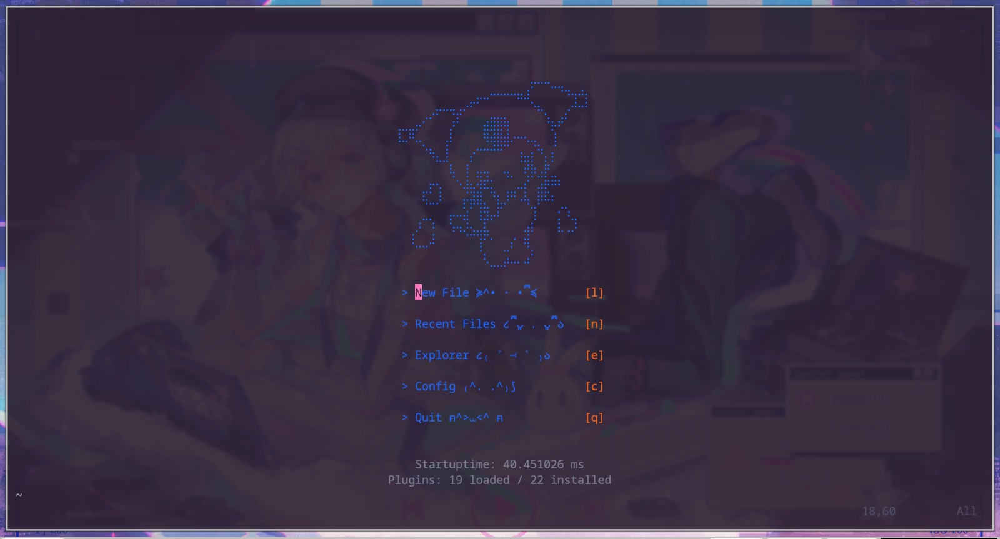
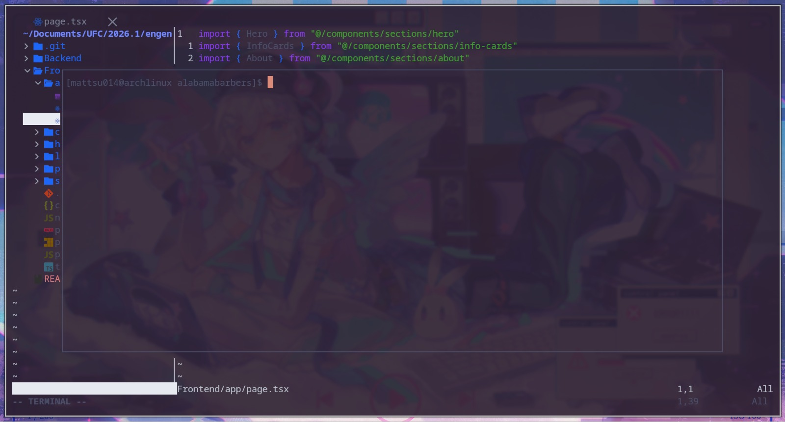
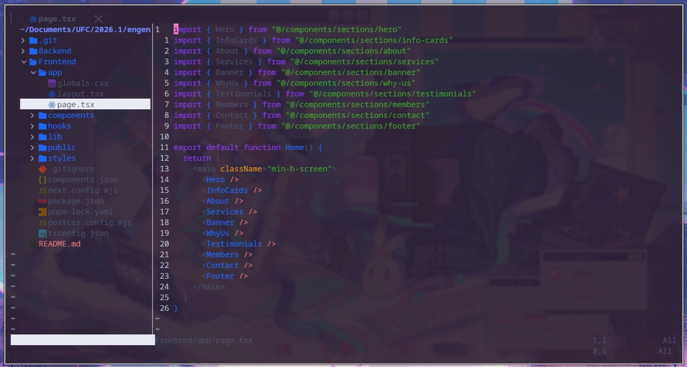

# 🧠 Configuração do Neovim (Minha Config)

Uma configuração moderna do Neovim focada em produtividade, simplicidade e desenvolvimento.


---

---

---

---

## 🌎 Idiomas

Português (Brasil) 🇧🇷

--- 

## 🚀 Primeiros Passos

Abra um projeto:

```bash
nvim .
```

Você verá um dashboard. A partir dele, você pode:

* abrir arquivos
* navegar pelas pastas
* começar a programar imediatamente

---

## 🧠 Conceito Principal: Modos

O Neovim é baseado em modos:

| Modo   | O que você faz              |
| ------ | --------------------------- |
| NORMAL | Navegar e executar comandos |
| INSERT | Digitar texto               |
| VISUAL | Selecionar texto            |

### Trocar de modo

* `i` → começar a digitar (INSERT)
* `ESC` → voltar para o NORMAL

---

## ⌨️ Tecla Leader

Sua tecla leader é:

```
ESPAÇO
```

A maioria dos comandos começa com ela.

---

## 📁 Abrir e Navegar Arquivos

### Abrir o explorador de arquivos

```
SPACE + e
```

* Use as setas ou `hjkl` para se mover
* Pressione `Enter` para abrir um arquivo

---

### Encontrar arquivos rapidamente

```
SPACE + f
```

* Comece a digitar o nome do arquivo
* Pressione `Enter` para abrir

👉 Esse é o jeito mais rápido de abrir arquivos.

---

## ✍️ Editando Texto

### Entrar no modo de inserção

```
i
```

### Salvar arquivo

```
:w
```

### Sair

```
:q
```

### Salvar e sair

```
:wq
```

---

## 🔁 Movimentação

No modo NORMAL:

```
h → esquerda
j → baixo
k → cima
l → direita
```

---

## 💬 Comentando Código

### Comentar uma linha

```
gcc
```

### Comentar várias linhas

1. Pressione `v` (modo visual)
2. Selecione as linhas
3. Pressione:

```
gc
```

---

## 💻 Usando o Terminal

Abrir terminal:

```
CTRL + \
```

* Execute comandos dentro do Neovim
* Pressione novamente para fechar

---

## 🧠 Autocomplete (Muito importante)

Enquanto digita no modo INSERT:

* `TAB` → próxima sugestão
* `SHIFT + TAB` → sugestão anterior
* `ENTER` → confirmar

Você terá:

* sugestões de funções
* variáveis
* imports

---

## 🚨 Visualizando Erros

### Mostrar todos os erros

```
SPACE + xx
```

### Erros no arquivo atual

```
SPACE + xd
```

---

## 🧵 Alternar entre arquivos

```
:bnext   → próximo arquivo
:bprev   → arquivo anterior
```

---

## 🔄 Editando Delimitadores (Surround)

Exemplos:

```
ysiw" → adiciona aspas a uma palavra
cs"'  → troca " por '
```

---

## 🧩 Se você esquecer comandos

Pressione:

```
SPACE
```

Um menu aparecerá mostrando tudo o que você pode fazer.

---

## 🔥 Fluxo de Trabalho Recomendado

1. Abrir projeto

   ```
   nvim .
   ```

2. Encontrar um arquivo

   ```
   SPACE + f
   ```

3. Editar

   ```
   i
   ```

4. Salvar

   ```
   :w
   ```

5. Alternar arquivos

   ```
   :bnext
   ```

6. Abrir terminal

   ```
   CTRL + \
   ```

---

## 💡 Dicas

* Fique no modo NORMAL o máximo possível
* Use `SPACE + f` em vez de navegar manualmente
* Aprenda pequenos comandos diariamente — eles acumulam rápido 🚀
